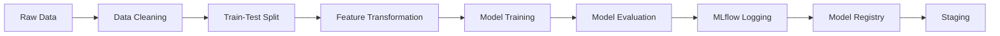

# Swiggy Delivery Time Prediction

An end-to-end machine learning pipeline that predicts food delivery time (in minutes) from order, rider, weather, traffic, and location data. Built as a reproducible **DVC pipeline**, tracked with **MLflow**, and served through a **FastAPI** endpoint — following real MLOps practices from raw data to a live prediction API.

## Project Overview

Given raw order details — rider age/rating, restaurant and delivery coordinates, weather, traffic density, vehicle type, and order timing — the model predicts how long a delivery will take. The project covers the full lifecycle: data cleaning → feature engineering → model training → experiment tracking → model registry → API serving → automated testing.

### Data Pipeline

1. **Raw data** — order-level records with rider, location, weather, traffic, and timing fields.
2. **Data cleaning** — domain-rule outlier removal (invalid ages/ratings), missing-value normalization, datetime parsing, and feature extraction: haversine distance between restaurant and delivery point, pickup delay (`order_picked_time - order_time`), time-of-day bucketing, and distance-type bucketing.
3. **Train/test split** — 80/20, reproducible via a fixed random seed, parameterized in `params.yaml`.
4. **Feature transformation** — a `ColumnTransformer` combining:
   - `MinMaxScaler` on numeric features (age, ratings, pickup time, distance)
   - `OneHotEncoder` on nominal categoricals (weather, order type, vehicle type, festival, city type, weekend flag, time of day)
   - `OrdinalEncoder` (with explicit category order) on ordinal categoricals (traffic density, distance type)

### Model Development

**Stacked ensemble regression:**

- **Base models:** Random Forest and LightGBM — chosen for their differing error profiles (variance-reduction via averaging vs. sequential bias-correction), giving the meta-model diverse signal to combine.
- **Meta-model:** Linear Regression, trained on 5-fold out-of-fold predictions from the base models (via `StackingRegressor(cv=5)`), avoiding leakage from in-sample predictions.
- **Target transform:** `PowerTransformer` (via `TransformedTargetRegressor`), applied since delivery time is right-skewed.
- Hyperparameters were tuned separately via **Optuna** and fixed into `params.yaml` for reproducible training.

### MLOps Pipeline (DVC)



The full pipeline is defined in `dvc.yaml` as six dependency-linked stages. Running `dvc repro` executes only the stages whose inputs (code or data) have actually changed since the last run — verified locally: rerunning with no changes skips every stage, and editing `train.py` alone correctly reruns only `train → evaluation → register_model` while skipping the earlier data stages.

1. **Experiment tracking** — MLflow, backed by a local SQLite store (`sqlite:///mlflow.db`), logging parameters, metrics (train/test MAE, R², 5-fold CV MAE), dataset lineage, and the model artifact with an inferred signature.
2. **Model registry** — each training run is registered under a named model (`delivery_time_pred_model`) and versioned; the current implementation promotes to the **Staging** stage after evaluation (a further Staging → Production gate is a natural next step, mirroring real deployment practice).

### API Layer

**FastAPI** serving layer (`app.py`):

- Pydantic model (`Data`) validating incoming request fields against the raw input schema.
- Loads the current Staging model version directly from the MLflow Model Registry at startup — promoting a new version and restarting the API serves the new model with no code changes.
- Runs incoming raw requests through the **same cleaning function** used at training time (`scripts/data_clean_utils.py`), eliminating train/serve skew.
- Auto-generated interactive docs at `/docs`.

### Testing

`tests/test_model_perf.py` — automated checks that gate model quality:

- Model loads and produces predictions of the correct shape
- Test MAE and R² stay within acceptable thresholds
- Domain sanity check: predicted delivery times are always positive

These are the kind of checks a CI pipeline would run before allowing a new model to be promoted or deployed.

## Project Structure

```
swiggy-delivery-prediction/
├── data/
│   ├── raw/            # original dataset
│   ├── cleaned/         # after data_cleaning.py
│   ├── interim/         # train/test split
│   └── processed/       # after feature transformation
├── models/               # trained model, transformers, preprocessor
├── src/
│   ├── data/             # cleaning, train/test split
│   ├── features/         # ColumnTransformer preprocessing
│   └── models/           # training, evaluation, registry
├── scripts/
│   └── data_clean_utils.py   # cleaning logic shared by training & serving
├── tests/
│   └── test_model_perf.py
├── app.py                # FastAPI serving layer
├── params.yaml            # data split & model hyperparameters
├── dvc.yaml                # pipeline stage definitions
└── requirements.txt
```

## Getting Started

### Prerequisites

- Python 3.10+
- Git
- pip

### Installation

```bash
git clone https://github.com/YOUR_USERNAME/swiggy-delivery-prediction.git
cd swiggy-delivery-prediction
python -m venv venv
venv\Scripts\activate        # Windows
source venv/bin/activate     # Mac/Linux
pip install -r requirements.txt
```

### Run the full pipeline

```bash
dvc init      # if not already initialized
dvc repro
```

This runs data cleaning, splitting, feature transformation, training, evaluation, and model registration, in dependency order — only re-executing stages whose inputs have changed.

### Start the API

```bash
uvicorn app:app --reload
```

Visit `http://127.0.0.1:8000/docs` for interactive API documentation and to test predictions.

### Run tests

```bash
pytest tests/ -v
```

## Model Performance

| Metric        | Train | Test  |
| ------------- | ----- | ----- |
| MAE (minutes) | 2.97  | 3.10  |
| R²            | 0.845 | 0.831 |

**5-fold cross-validation MAE:** 3.07 minutes — closely matching the held-out test MAE, indicating the model generalizes consistently rather than overfitting to a particular split.

On average, predictions are within ~3 minutes of actual delivery time, explaining ~83% of the variance in delivery duration.

## What's Next

- Promote validated models from Staging to Production automatically after tests pass
- Containerize the API with Docker and add a CI workflow (tests → build → deploy)
- Incorporate live traffic/weather signals to close more of the remaining unexplained variance
